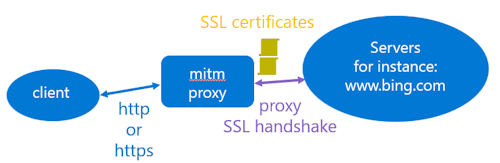
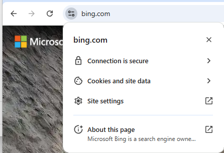
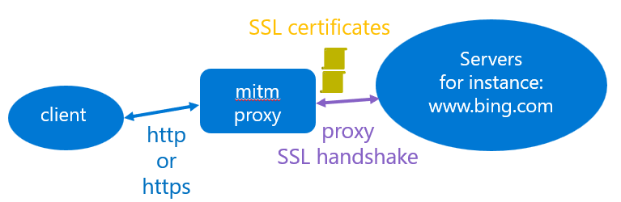

# How to test Squid proxy and mitmproxy in Azure

## Introduction

This repository contains the documentations and the code to deploy either a Squid proxy (https://www.squid-cache.org/) and or a mitmproxy (https://mitmproxy.org/) running in a virtual machine in your Azure Subscription.  

If you need to test, deploy services and applications running behind a proxy. You could test this deployment using proxies deployed from this repository. Moreover, from a security perspective, those proxies could be used to capture all the endpoints used by your applications or services in checking the proxy log file 'access.log'.  

By default, with the Squid proxy is configured and deployed to support end-to-end SSL handshake. With this configuration the client applications will accept the connection to the services through the proxy as it's an end-to-end SSL handshake.  


At least, with the mitmproxy, it's possible to decrypt the SSL traffic. In that case, the SSL handshake occurs between the mitmproxy and the services.   


This document contains the following chapters:  

- How to use Dev Container in Visual Studio Code: from your Dev Container, it will be easier to deploy and test your proxies  
- How to deploy and test the proxy infrastructure
- How to analyze the proxy log files

## Using Dev Container in Visual Studio Code

The Visual Studio Code Dev Containers extension lets you use a container as a full-featured development environment. It allows you to open any folder inside (or mounted into) a container and take advantage of Visual Studio Code's full feature set.

For more detailed information, refer to the [Developing inside a Container](https://code.visualstudio.com/docs/devcontainers/containers) documentation.

### Installing the pre-requisites

In order to test the solution, you need first an Azure Subscription, you can get further information about Azure Subscription [here](https://azure.microsoft.com/en-us/free).

You also need to install Git client and Visual Studio Code on your machine, below the links.

|[](https://git-scm.com/download/win) |[](https://git-scm.com/download/linux)|[](https://git-scm.com/download/mac)|
|:---|:---|:---|
| [Git Client for Windows](https://git-scm.com/download/win) | [Git client for Linux](https://git-scm.com/download/linux)| [Git Client for MacOs](https://git-scm.com/download/mac) |
[Visual Studio Code for Windows](https://code.visualstudio.com/Download)  | [Visual Studio Code for Linux](https://code.visualstudio.com/Download)  &nbsp;| [Visual Studio Code for MacOS](https://code.visualstudio.com/Download) &nbsp; &nbsp;|

Once the Git client is installed you can clone the repository on your machine running the following commands:

1. Create a Git directory on your machine

    ```bash
        c:\> mkdir git
        c:\> cd git
        c:\git>
    ```

2. Clone the repository.  
    For instance:

    ```bash
        c:\git> git clone  https://github.com/flecoqui/test-proxy.git 
        c:\git> cd ./test-proxy
        c:\git\test-proxy> 
    ```

### Requirements

You need to install the following pre-requisite on your machine.

1. Install and configure [Docker](https://www.docker.com/get-started) for your operating system.

   - Windows / macOS:

     1. Install [Docker Desktop](https://www.docker.com/products/docker-desktop) for Windows/Mac.

     2. Right-click on the Docker task bar item, select Settings / Preferences and update Resources > File Sharing with any locations your source code is kept. See [tips and tricks](https://code.visualstudio.com/docs/remote/troubleshooting#_container-tips) for troubleshooting.

     3. If you are using WSL 2 on Windows, to enable the [Windows WSL 2 back-end](https://docs.docker.com/docker-for-windows/wsl/): Right-click on the Docker taskbar item and select Settings. Check Use the WSL 2 based engine and verify your distribution is enabled under Resources > WSL Integration.

   - Linux:

     1. Follow the official install [instructions for Docker CE/EE for your distribution](https://docs.docker.com/get-docker/). If you are using Docker Compose, follow the [Docker Compose directions](https://docs.docker.com/compose/install/) as well.

     2. Add your user to the docker group by using a terminal to run: 'sudo usermod -aG docker $USER'

     3. Sign out and back in again so your changes take effect.

2. Ensure [Visual Studio Code](https://code.visualstudio.com/) is already installed.

3. Install the [Remote Development extension pack](https://marketplace.visualstudio.com/items?itemName=ms-vscode-remote.vscode-remote-extensionpack).

### Open the solution in the Dev Container

1. Launch Visual Studio Code in the folder where you cloned the repository.

    ```bash
        ~/projects/NNMicrosoftEngagement_V2$ code .
    ```

2. Once Visual Studio Code is launched, you should see the following dialog box:

    

3. Click on the button `Reopen in Container`
4. Visual Studio Code opens the Dev Container. If it's the first time you open the project in container mode, it first builds the container, it can take several minutes to build the new container.
5. Once the container is loaded, you can open a new terminal (Terminal -> New Terminal).
6. From the terminal, you have access to the tools installed in the Dev Container, such as the `az` client.

    ```bash
        vscode ➜ /workspaces/test-proxy (main) $ az login
    ```

    vscode ➜ /workspaces/test-proxy (main) $ `az login`


## How to deploy and test the proxy infrastructure

1. Before deploying the infrastructure, you need first to get a connection with your Microsoft Entra ID Tenant and Azure Subscription from the Dev Container terminal runninng the following comamnds.  

    ```bash
        vscode ➜ /workspaces/test-proxy (main) $ az login -t [TENANT-ID]
        vscode ➜ /workspaces/test-proxy (main) $ az account set --subscription [SUSCRIPTION-ID]
    ```

2. You can now create the configuration file to deploy your infrastructure.  

    ```bash
        vscode ➜ /workspaces/test-proxy (main) $ ./scripts/proxy-global-tool.sh -a createconfig -c ./configuration/test.env  -r [AZURE-REGION]
    ```

    Where AZURE-REGION is the Azure region where you want to deploy the proxy.
    The script file './scripts/proxy-global-tool.sh' creates the envrionment file './configuration/test.env' which contains all the deployment parameters. The variable 'AZURE_PROXY_SUFFIX' contains the string which be used to name the resource group, virtual machine, ...

3. Once the configuration file is created, you can deploy the infrastructure in the Azure Region with the following input parameters:

   - '-k': kind of proxy: 'squidproxy' or 'mitmproxy'  
   - '-p': TCP port associated with the proxy  
   - '-u': user name used for the proxy credentials  
   - '-w': user name password used for the proxy credentials  
   - '-d': a string which contains the list of the allowed domains for the proxy (';' as separator), add the domain 'ifconfig.me' in this list, as it will be used for the tests.  

   With the command line below, Squid proxy will be deployed.

    ```bash
        vscode ➜ /workspaces/test-proxy (main) $ ./scripts/proxy-global-tool.sh -a deploy -k squidproxy -c ./configuration/test.env -p 8080 -u azureuser -w au -d 'ifconfig.me;.bing.com;.microsoft.com'
    ```

   With the command line below, mitmproxy will be deployed. This proxy requires the creation of a Certificate Authority which will be used for the client authentication with the proxy.

    ```bash
        vscode ➜ /workspaces/test-proxy (main) $ ./scripts/proxy-global-tool.sh -a deploy -k mitmproxy -c ./configuration/test.env -p 8080 -u azureuser -w au -d '.me;.com;.sx;.ru:.la;.tech;.net;.top;.pw;.goog;.org;.eu;.ms;.microsoft;.se;.ip;.co;.click;.online;.us;.xyz;.pro;.info;.best;.re;.love;.at'
    ```

    When the deployment is completed, the following variables are displayed in the terminal:

    ```bash
    AZURE_RESOURCE_PROXY_KIND=squidproxy
    AZURE_RESOURCE_PROXY_PORT=8080
    AZURE_RESOURCE_PROXY_DNS_NAME=pipprxdev4818proxy.francecentral.cloudapp.azure.com
    AZURE_RESOURCE_PROXY_USERNAME=azureuser
    AZURE_RESOURCE_PROXY_PASSWORD=au
    AZURE_RESOURCE_PROXY_DOMAIN_LIST="ifconfig.me;.bing.com;.microsoft.com"
    AZURE_RESOURCE_HTTP_PROXY=http://azureuser:au@pipprxdev4818proxy.francecentral.cloudapp.azure.com:8080/
    AZURE_RESOURCE_HTTPS_PROXY=http://azureuser:au@pipprxdev4818proxy.francecentral.cloudapp.azure.com:8080/
    ```

    The variables 'AZURE_RESOURCE_HTTP_PROXY' and 'AZURE_RESOURCE_HTTPS_PROXY' are useful if you want to use the proxy from your local application.

## How to test the proxy infrastructure

Once the deployment is completed, you can test the proxy is fully functionning using the following command:

```bash
    vscode ➜ /workspaces/test-proxy (main) $ ./scripts/proxy-global-tool.sh -a test -c ./configuration/test.env
```

The test will open "http://ifconfig.me" without proxy to know the local public IP address. Then it will call "http://ifconfig.me" and "https://ifconfig.me" through the proxy to get the public IP address of the proxy, it will test the proxy is supporting 'http' and 'https'.
It the same command line for Squid Proxy and mitmproxy. The mitmproxy requires a Certificate Authority for the authentication with the proxy.

### Using the Squid proxy with curl

In the Dev Container, you can use the curl command to test the Squid proxy using the '--proxy' option to set the proxy url with the following format: "http://[user]:[password]@[hostname]:[port]/"
    For instance:

```bash
    vscode ➜ /workspaces/test-proxy (main) $ curl --proxy http://azureuser:au@pipprxdev3315proxy.swedencentral.cloudapp.azure.com:8080/ https://ifconfig.me
```

### Using the mitmproxy with curl

In the Dev Container, you can use the curl command to test the mitmproxy using the '--proxy' and '--cacert' options to set respectively the proxy url with the following format: "http://[user]:[password]@[hostname]:[port]/" and the file containing the certifcate authority associated with the mitmproxy.  
To create the file containing the certificate auhtority, you need to copy the value of the variable 'PROXY_CERTIFICATE_AUTHORITY' in the configuration file.  
For instance the command line below create the local file containing the Certificate Authority:  

```bash
    echo "${PROXY_CERTIFICATE_AUTHORITY}" > "${PROXY_FOLDER}/ca.crt"
```

For instance, below a command line to use the mitmproxy:

```bash
    vscode ➜ /workspaces/test-proxy (main) $ curl -s --cacert /tmp/tmp.iLzGuERXY3/ca.crt --proxy http://azureuser:au@pipprxdev3315proxy.swedencentral.cloudapp.azure.com:8080/ https://ifconfig.me
```

When mitmproxy is installed, by default it creates a certificate authority and the associated key under ~/.mitmproxy on the proxy virtual machine hard drive. With the current deployment, the certificate authority is created in the installation script, and the certificate is stored under the folder '/usr/local/bin/mitmproxy/cert'. The path of the certificate is defined in the file '/usr/local/bin/mitmproxy/mitmproxy.sh' which launch the proxy with the option '--set confdir=' (see below).

```bash
    cat <<BASH | sudo tee /usr/local/bin/mitmproxy/mitmproxy.sh  
#!/bin/bash
/usr/local/bin/mitmproxy/mitmdump --mode regular  --set block_global=false --showhost -p ${AZURE_RESOURCE_PROXY_PORT} --set confdir=/usr/local/bin/mitmproxy/cert   --proxyauth  @/usr/local/bin/mitmproxy/passwd ${IGNORE_HOST_LIST} --set tls_version_client_min=TLS1_2 --show-ignored-hosts -s /usr/local/bin/mitmproxy/domains_filter_parent.py &>> /var/log/mitmproxy/mitmproxy.log 
BASH
```

### Using the Squid proxy with your Browser

Now, the Squid proxy is running, you can also configure your Browser to use your proxy.

1. On your Browser, click on the 3 dots button on the navigation bar. The menu is displayed, select the submenu 'Settings'  

2. Enter 'proxy' in the search edit box, press on the enter key. Select the link 'Open you computer's proxy settings'.  

3. On the proxy setting page, uncheck the option 'Automatically detect settings' and click on the button 'Set up' associated with the option 'Use a proxy server'.  

4. In the dialog box 'Edit proxy server' enter the dns name of your proxy in the edit box 'Proxy Ip Address', and the port associated with your proxy in the Edit box 'Port'.  Then click on the button 'Save' to save the proxy configuration.  

5. Now, you can use your browser to open for instance the web site 'bing.com'. Then click on the button close the 'url' edit box to display the web site certificate. Click on the link 'Connection is secure'  

6. Click on the link 'Certificate is valid'  

7. On the certificate page, you can verify the certificate is associated with 'r.bing.com' and the certificate issue is Microsoft Corportation.  

8. With Squid Proxy the Browser (Client Application) displays the Web Site certificate, as it supports end-to-end SSL handshakes.  


### Using the mitmproxy with your Browser

When the mitmproxy is running, you can also configure your Browser to use your proxy, you will also need to install the mitmproxy certificate authority on your machine.  

1. On your Browser, click on the 3 dots button on the navigation bar. The menu is displayed, select the submenu 'Settings'  

2. Enter 'proxy' in the search edit box, press on the enter key. Select the link 'Open you computer's proxy settings'.  

3. On the proxy setting page, uncheck the option 'Automatically detect settings' and click on the button 'Set up' associated with the option 'Use a proxy server'.  

4. In the dialog box 'Edit proxy server' enter the dns name of your proxy in the edit box 'Proxy Ip Address', and the port associated with your proxy in the Edit box 'Port'.  Then click on the button 'Save' to save the proxy configuration.  

5. The Browser is now configured to support the mitmproxy. Now, you need to import the mitmproxy certificate which is stored in the variable 'PROXY_CERTIFICATE_AUTHORITY'. Copy the value of the variable and store the value in a local file with '.crt' extension.
Click on 'Windows' Key and 'R' key, enter 'mmc.exe' in the edit box to launch the Mangement Console while clicking on the 'OK' button.  

6. The console is displayed:  

7. Select the menu 'File'-> 'Add/Remove Snap-in' to add the Certificate snap-in.  

8. Select 'Certiifcates' in the list on the left and click on the 'Add' button.  

9. Select 'Computer Account' and click on 'Next' button.  

10. Select 'Local computer' and click on 'Finish' button.  

11. The Certificates is added in the 'Selected snap-in' list, click on the OK button to close the dialog box.  

12. In the Certificates console, select the tree: 'Trusted Root Certificate Authorities->Certificates' and click on the mouse right button to display the pop-up menu and select the 'All Tasks'->'Import...' submenu to import a certificate.  

13. Click on the 'Browse' button to select the certificate file created above and click on the 'Next' button.  

14. click on the 'Next' button.  

15. click on the 'Finish' button to complete the import process.  

16. Now you can see the contoso.com certificate in the list of 'Trusted Root Certificate Authorities->Certificates'  

17. Now, you can use your browser to open for instance the web site 'bing.com'. Then click on the button close the 'url' edit box to display the web site certificate. Click on the link 'Connection is secure'  

18. Click on the link 'Certificate is valid'  

19. On the certificate page, you can verify the certificate is associated with 'r.bing.com' and the certificate issuer is Contoso organisation associated with the Certificate Installed in the mitmproxy.  

20. With mitmroxy the Browser (Client Application) displays the Proxy certificate, as it doesn't support end-to-end SSL handshakes.  


**Note**:  
If on your browser, you enter an url associated with a domain name which is not allowed by the proxy configuration, the following message will be displayed on the page:

```bash
    Blocked by mitmproxy
```

## How to use proxies log files

### Using logs with mitmproxy

By default, the mitmproxy use the file '/var/log/mitmproxy/mitmproxy.log' to store the default logs. This file can contain for instance the certificate issue.

```bash
    azureuser@proxyprxdevXXXX:~$ sudo cat /var/log/mitmproxy/mitmproxy.log
```

The log file '/var/log/mitmproxy/access.log' contains the list of http requests supported by the proxy:

```bash
    azureuser@proxyprxdevXXXX:~$ sudo cat /var/log/mitmproxy/access.log
```

The log file '/var/log/mitmproxy/dump.log' contains the body of the http requests when the proxy is configured to dump the http requests (see next paragraph).

```bash
    azureuser@proxyprxdevXXXX:~$ sudo cat /var/log/mitmproxy/dump.log
```

### Using deep packet inspection with mitmproxy

If you want to configure the proxy to dump the body of the https request, you need to set the variable 'DUMP_PROXY' to true. 

```bash
    azureuser@proxyprxdevXXXX:~$ sudo vi /etc/environment
```

Edit the file '/etc/environment' and set DUMP_PROXY=true

Then restart the proxy with the following command line:

```bash
    azureuser@proxyprxdevXXXX:~$ sudo systemctl restart mitmproxy.service
```

Moreover, if you use Wireshark, you can get the SSL keys used by mitmproxy to encrypt the traffic from the file:   
/var/log/mitmproxy/sslkeylogfile.txt

Further information [here](https://docs.mitmproxy.org/stable/howto-wireshark-tls/)


### Using logs with squidproxy

The log file '/var/log/squid/access.log' contains the list of http requests supported by the proxy:

```bash
    azureuser@proxyprxdevXXXX:~$ sudo cat /var/log/squid/access.log
```

If you run the following command, you can list all the requests which are blocked by the proxy:

```bash
    azureuser@proxyprxdevXXXX:~$ sudo cat /var/log/squid/access.log | grep DENIED
```

By default, Squid proxy is not configured to support Deep Packet Inspection.

## How to undeploy the infrastructure

Once you are done with your tests, you can remove the proxy infrastructure running the following command:

```bash
    vscode ➜ /workspaces/test-proxy (main) $ ./scripts/proxy-global-tool.sh -a undeploy -c ./configuration/test.env
```
